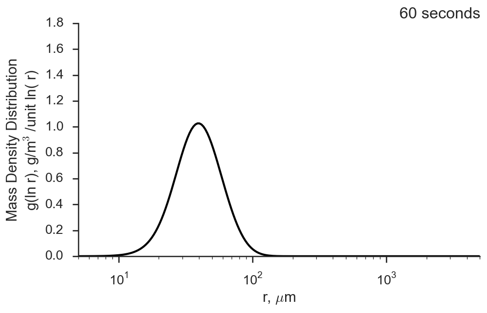

# Superdroplet

This is a collection of implementations of the 
[Shima et al, 2009](http://dx.doi.org/10.1002/qj.441) Superdroplet algorithm
for simulating stochastic collision/coalescence by a nascent droplet population,
 with modifications based on [Arabas et al, 2015](http://10.5194/gmd-8-1677-2015).

Because if its (relative) complexity, this algorithm is my go-to "hello world"
scientific programming applicaiton. It has enough meat to really dive into 
some of the nitty, gritty details of how to properly structure code and how
to leverage idiosyncrasies of data structures in those languages to accelerate
things. It can be ported to the GPU, it can be parallelized, it can benefit
from OO techniques, and much, much more.

So far, as contained in this repository, I've implemented the algorithm in 
at least 5 dialects:

1. Python with [Cython](http://cython.org)
2. Python with [numba](http://numba.pydata.org)
3. C++11
4. Fortran 2008
5. [Julia](http://julialang.org)

## Sample Animations

*Example 1)* Medium-sized cloud droplets with a Golovin kernel

*Example 2)* Small-sized cloud droplets with a Hall kernel

