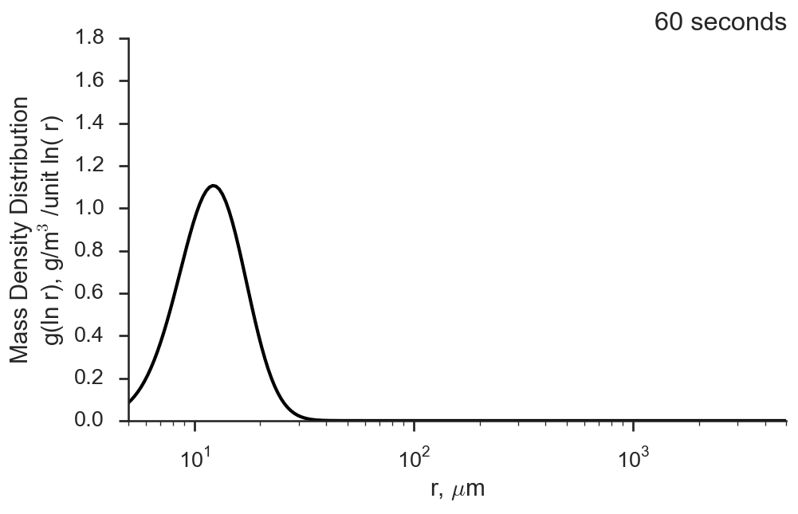

# Superdroplet

This is a collection of implementations of the 
[Shima et al, 2009](http://dx.doi.org/10.1002/qj.441) Superdroplet algorithm
for simulating stochastic collision/coalescence by a nascent droplet population,
 with modifications based on [Arabas et al, 2015](http://10.5194/gmd-8-1677-2015).

This algorithm is my go-to "hello world" scientific programming application. It's not
particularly complicated, but its structure requires that any implementation cover
a variety of programming and data structures topics. It lends itself well to a very
lightweight object-oriented approach, and the possibilities for eking out performance
are very broad. 

We recently overhauled the code here to more uniformly apply the same core implementationt
across all of the example languages. Those languages include:

1. Pure Python - no third-party libraries of any kind
2. Python optimied with NumPy and Numba
3. C++11 - we don't need any of the newer language features for this implementation
4. Fortran 2008 - similarly to C++, we don't use any F2018/2023 features, which are poorly supported in `gfortran` anyways.
5. Rust
6. Julia

Wherever possible we restrict to the core language standard lib. This is most evident
when writing the output CSV files, since one really shouldn't need much more than
a file handle to be able to create these.

## Implementation Details

Our implementation is divided into two pairs:

1. A library with helpful utilities and physical parameterizations
2. A main "program" which sets up a stochastic collision-coalescence experiment
   and uses the library to drive a simulation

### Data Structures

We use a data-oriented approach to model interactions between `Droplet` objects as
the core process undergirding a Monte Carlo sampling method. In most languages, we
implement a `Droplet` as a struct; while not leveraged here we could consider a class
hierarchy of `Droplet`-types encoding additional information about each droplet. The
only practical consequence here is that we don't use an object-oriented approach simply
for the sake of having "objects" - we just want to package information together.

The simulation itself operates on a fixed-length vector of `Droplet` objects - an
"array-of-structs" approach. Again, this is just for simplicity; any high-performance
approach would shift to a "struct-of-arrays", but we sacrifice the model of droplets
interacting with each other in this setup.

A `Droplet` implements a "super-droplet", representing a collection of many thousands
of physical droplets with specific physical details (size, water mass, solute mass, etc).

### Simulation Structure

Our main algorithm has a very simple linear structure:

```
PROGRAM sce
    Set up superdroplet population
    Record diagnostics on population (e.g. super droplet)
    while (simulation not complete):
        Perform droplet collisions and record results on population
        if plot output step:
            Write a binned distribution of droplet mass to disk
END PROGRAM
```

We use this structure because it very clearly encodes a "hot loop" where we spend
the vast majority of our computation time - performing droplet collisions per simulation
timestep. This hot loop uses a random sampling approach where we randomly sample
pairs of droplets from our population and perform a collision heuristic gated by
a sampling probability. The probability is related to a "collision kernel", which
crudely parameterizes the likelihood that two droplets of different sizes would collide
and stick together, treated as a volume-normalized collision rate. 

If we compute that two droplets will collide and stick, then we use a heuristic to
split the resulting droplets. The core idea is to consume all of the droplet with a
smaller multiplicity to create a third droplet type using the weight combination of
the two colliding droplets. There will always be one droplet fully consumed in this
process, meaning that we only have to save the details about two droplet in the output.
We do this by replacing the fully-consumed droplet with the details from the third,
"coalesced" droplet, and we subtract the multiplicity of droplets consumed in this
process from the other original droplet. In some cases, this remaining multiplicity
is zero; we record that and if this droplet is selected for collision in future
iteration steps, we simply don't record anything. This doesn't perturb the core
statistical assumptios of the model, and allows us to use fixed-size data structures
to record the droplet population, a significant performance optimization.

The simulation completes after a prescribed number of steps, usually expressed
as an elapsed time.

### Common Performance Optimizations

The structure of this simulation is very simple and is explicitly designed to
transparently provide opportunities for simple, common-place performance optimizations
which often come in handy:

1. **Fast math** - Often times, languages support generic arithmetic operations, but
   provide faster implementations of certain functions (the cube root is a great example,
   as is fused multiply-addition functions which can target an optimized instrinsic). Also,
   many compiled languages support a "fastmath" flag at build time that makes some
   trade-offs to improve performance.
2. **Pass-by-reference/pointer** - Many languages support the ability to pass arguments
   to functions or subroutines by either their actual value or a reference to an object
   in memory. In the former, one must often clone or make a deep copy of the object - an
   expensive operation. Passing pointers or references to objects is much more efficient,
   but comes with challenges relating to borrowing references or mutating the values pointed
   to them - potentially unsafe operations which can lead to memory leaks or undefined
   behavior if the user isn't careful. So this becomes a balancing act to extract performance
   at the cost of building defensively to avoid making mistakes.
3. **Pre-generation or op amortization** - In the "hot loop" of the collision step in
   the algorithm, we must compute and store a fair number of intermediate results such
   as probabilities. It becomes extremely important to consider the cost of these
   operations as well as the cost of creating the data structures that contain them - in
   some cases, it may be helpful to pre-allocate enough memory on the heap and to
   carefully mutate them to speed things up.
4. **Stochasticity** - Because this simulation is effectively a Monte Carlo calculation,
   the nature of random number generators can have a significant impact on the simulation
   results. But in practice, we really just have to guarantee "enough" randomness - we don't
   need cryptography-grade random number generation. The cost associated with modeling
   and sampling from random variables is frequently overlooked in computational models,
   but often provides unqiue opportunities to make clever performance optimizations.
5. **Shuffling state vectors** - To go along with the stochastic component, at the heart
   of this algorithm is a step where we "shuffle" the droplet population. The entire point
   of this process is to help us generate random pairs to simulate collisions. There is
   a spectrum of complexity we can choose to implement this - everything from functions
   which mutate a vector by randomly swapping elements (which could incur penalties 
   related to (2) above) to the more complex approach of generating random indices to
   pull from the state vector. Any approach has trade-offs - usually sacrificing 
   performance for conceptual simplicity.
5. **Parallelization** - The collision step itself has a hot loop where we perform
   the simulated collision interactions. By construction, this can be split over an
   arbitrary set of chunks pulled from the state vector - either sampling the entire
   vector from shared memory or by breaking it down into chunks containing the droplets
   that will interact. As a result, the program can greatly benefit from simply performing
   the steps of this hot loop in parallel across distributed tasks or threads. But, again,
   this comes with trade-offs relating to nitty gritty details about how various
   counters and tabulators are updated to how we must carefully mutate the state of a
   droplet potentially held in shared memory.


Beyond this, there are a slew of explicit optimizations built-in to the core algorithm
implemented across languages here. The most notable one is that we eagerly re-compute
a `Droplet`'s size-dependent characeteristics (such as its terminal velocity) whenever
we mutate it. Even though we don't need to know this information at every single model step,
we're guaranteed that it will be accessed whenever the `Droplet` is involved in a collision
event, so we can save the overhead of caling function pointers and passing references or
data by simply computing things up front. It disencentives leaning too heavily into our
`Droplet`s as true "objects" with bound methods - beyond the purposes of pretty code,
why bind the implementation of a parameteriation to an object when it's explicitly
defined with respect to objext properties instead of the object itself?

## Sample Animations

*Example 1)* Medium-sized cloud droplets with a Golovin kernel


*Example 2)* Small-sized cloud droplets with a Hall kernel



## Performance Testing

The performance statistics we provide here were generated using an extremely simple
protocol: we merely implemented a stopwatch in all of the core programs that tracks
the total elapsed time between just before the main model simulation loop begins
and when cleanup is finished. This means that we bake-in any just-in-time compilation
times for Julia and Numba.

The first round of timing runs were performed on a machine running Linux Mint with
kernel 6.8, powered by a Ryzen 7 7700X. We performed a 3600 second simulation with
an internal timestep of 1 second, using the Golovin kernel:

<table>
   <tr>
      <td> </td>
      <td colspan="4"><b># of Superdroplets</b></td>
   </tr>
   <tr>
      <td><b>Language</b></td>
      <td>2<sup>15</sup></td>
      <td>2<sup>17</sup></td>
      <td>2<sup>19</sup></td>
      <td>2<sup>21</sup></td>
   </tr>
   <tr>
      <td><b>Python<sup>†</sup></b></td>
      <td></td>
      <td></td>
      <td></td>
      <td></td>
   </tr>
   <tr>
      <td><b>Python w/ Numba</b></td>
      <td>3.9</td>
      <td>15.8</td>
      <td>175.2</td>
      <td>874.5</td>
   </tr>
   <tr>
      <td><b>Julia</b></td>
      <td>0.9</td>
      <td>4.4</td>
      <td>43.8</td>
      <td>373.5</td>
   </tr>
   <tr>
      <td><b>C++</b></td>
      <td>0.7</td>
      <td>2.9</td>
      <td>19.6</td>
      <td>155.3</td>
   </tr>
   <tr>
      <td><b>Fortran</b></td>
      <td>1.9</td>
      <td>11.5</td>
      <td>68.2</td>
      <td>347.9</td>
   </tr>
   <tr>
      <td><b>Rust</b></td>
      <td>1.0</td>
      <td>4.2</td>
      <td>38.2</td>
      <td>245.9</td>
   </tr>
</table>

> [!NOTE]
> We don't have reliable vanilla Python timing because the model is so slow;
> performance is dominated by what happens ~45 minutes into the simulation,
> where the number of collisions per step notably increases. It would take
> about 13 minutes using O(200k) superdroplets to reach this stage, which
> is already slower by 2x-4x compared to the other implementations when they
> have 64x more droplets to track!


---

All tests done with 2^17 = 131,072 superdroplets using a Golovin kernel out to 3600 seconds with a 1 second step time.


| **Implementation** | **Time (seconds)** |
| ------------------ | ------------------ |
| Rust | 7.49 |
| Julia | 16.44 |
